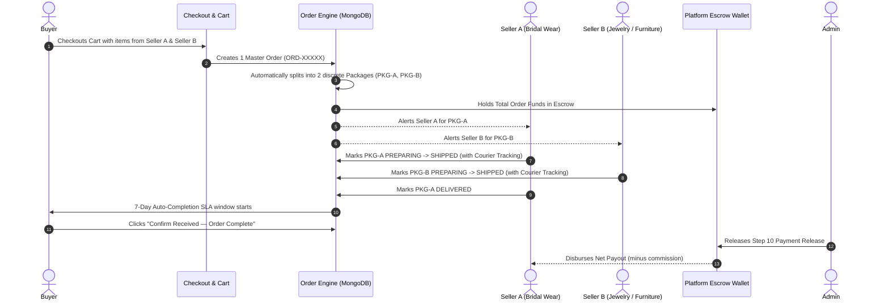
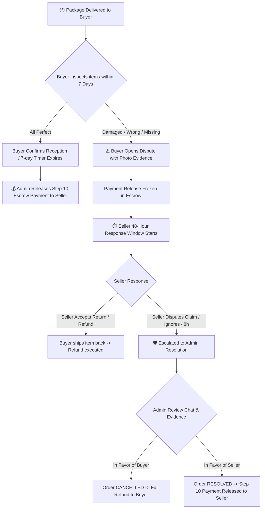
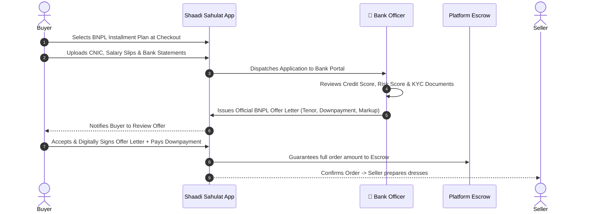

# 💍 Shaadi Sahulat — System Architecture, Role Functionalities & Cross-Connections

---

## 📌 1. Executive Overview

**Shaadi Sahulat** is an AI-powered end-to-end wedding ecosystem designed to modernize wedding preparation, dress shopping, dowry estimation, and installment financing in Pakistan. The platform bridges **Buyers**, **Sellers**, **Bank Officers (BNPL)**, and **Platform Administrators** into a unified, secure escrow-based marketplace.

---

## 👥 2. Four Core Roles & Detailed Functionalities

```
                     ┌───────────────────────────────────────────────┐
                     │           🛡️ PLATFORM ADMINISTRATOR           │
                     │  (Catalog, Escrow Releases, Dispute Arbiter)  │
                     └───────┬───────────────────────────────┬───────┘
                             │                               │
             Platform Policy │                               │ Escrow / Settlements
             & Gating        │                               │
                             ▼                               ▼
  ┌─────────────────────────────────────┐         ┌─────────────────────────────────────┐
  │              👤 BUYER               │◄───────►│              🏬 SELLER              │
  │   - Retail / Thrift Marketplace     │ Packages│   - 6 Catalog Major Categories      │
  │   - Visual Search & Virtual Try-On  │  Orders │   - Multi-Package Fulfillment       │
  │   - AI Dowry Budget Estimator       │ Disputes│   - 48h Dispute Resolution          │
  │   - BNPL Installment Financing      │         │   - Earnings Wallet & Payouts       │
  └──────────────────┬──────────────────┘         └─────────────────────────────────────┘
                     │
     Installment App │ Credit Assessment
     & Repayments    │ & Offer Letters
                     ▼
  ┌─────────────────────────────────────┐
  │          🏦 BANK OFFICER            │
  │   - BNPL Application Review         │
  │   - Credit Scoring & KYC Docs       │
  │   - Offer Letter Issuance           │
  │   - Repayments & Default Tracking   │
  └─────────────────────────────────────┘
```

---

### 🛍️ 2.1 The Buyer Ecosystem (`/buyer/*`)

| Capability | Detailed Functionality | Technical Connection |
| :--- | :--- | :--- |
| **Marketplace & Thrift Storefront** | Browse wedding apparel across **New Retail** and verified **Thrift (Pre-loved)** collections with price range filtering, condition flags, and dynamic custom fields. | Connects to `seller_products` in MongoDB and Flask visual ML backend. |
| **Find by Photo (Visual Search)** | Upload any wedding dress image. System runs safety validation + deep feature embeddings to match similar dresses in catalog. | Queries `visual-ml-service` (CLIP/ResNet embeddings + FAISS cosine similarity). |
| **Virtual Try-On (VTON)** | Upload user photo to preview how a selected bridal dress looks on the customer before buying. | Integrates `visual-ml-service` pose estimation, human parsing, and dress warping. |
| **Voice & Tone AI Assistant** | Multilingual speech-to-speech conversational shopping assistant capable of answering product, dowry, and sizing queries. | Uses `tone-voice` microservice (Kokoro TTS + Whisper STT + LLM response). |
| **AI Dowry Planner & Estimator** | Input financial tier, city, and family preferences to generate categorized dowry budgets with real marketplace product recommendations. | Powered by `ml-service` regression models + `DowryEstimation` MongoDB collection. |
| **BNPL Checkout & Installments** | Choose **Buy Now Pay Later (BNPL)** at checkout. Upload salary slips, CNIC, and bank statements for installment financing. | Creates `BnplApplication` and notifies Bank Officers. |
| **Order Tracking & Confirmations** | Real-time multi-package progress tracking with branching timeline. 7-day confirmation window with SLA countdown timer. | Submits feedback to `Order.timeline` and updates Escrow status. |
| **Dispute Management** | If an item is damaged, wrong, or missing, open a dispute with photo/video evidence. Automatically freezes seller payout release. | Triggers `Dispute` model and starts Seller's 48-hour response window. |

---

### 🏬 2.2 The Seller Ecosystem (`/seller/*`)

| Capability | Detailed Functionality | Technical Connection |
| :--- | :--- | :--- |
| **Product Upload & Catalog Management** | Upload items under 6 Major Categories (Bridal/Groom Apparel, Furniture, Electronics, Kitchen, Decoration, Misc) with condition tags and dynamic custom fields. | Images upload to Cloudinary; metadata saved to MongoDB. |
| **Thrift & Condition Gating** | Sellers can list pre-loved garments with original purchase proof, condition rating (New, Like New, Thrift), and discounted rates. | Thrift items flagged for admin quality approval before public display. |
| **Multi-Package Fulfillment** | When a buyer places a multi-vendor order, the order splits into discrete **Packages** per seller. | Interacts with `Package` model (`PREPARING` → `SHIPPED` → `DELIVERED`). |
| **Shipping & Courier Tracking** | Enter courier name, dispatch date, and tracking number. System exposes tracking code only after physical dispatch. | Updates `Package.tracking_number` and transitions timeline to `SHIPPED`. |
| **48-Hour Dispute Response** | When a buyer disputes a package, seller receives a high-priority SLA countdown to respond, accept replacement, or escalate to Admin. | Modifies `Dispute` state (`SELLER_RESPONDED` / `UNDER_REVIEW`). |
| **Seller Wallet & Payouts** | View completed order revenues, platform commission deductions (e.g. 10%), and bank transfer settlements. | Reads `SellerPayout` records released by Admin. |

---

### 🛡️ 2.3 The Platform Admin (`/admin/*`)

| Capability | Detailed Functionality | Technical Connection |
| :--- | :--- | :--- |
| **Catalog & Category Manager** | Create, edit, and soft-delete categories, subcategories, price bounds, placeholder images, and custom seller form attributes. | `AdminCategory` MongoDB collection + Cloudinary Category Placeholders. |
| **Escrow & Payment Release (Step 10)** | Oversee delivered and resolved orders. Inspect delivery confirmations and execute one-click release of funds to seller wallets. | Debits Platform Reserve and logs credit to `SellerPayout` + `AdminWallet`. |
| **Dispute Arbitration** | Act as final impartial judge in buyer-seller disagreements. Review evidence files, inspect chat logs, and issue refunds or payout approvals. | Closes `Dispute` (`RESOLVED` / `CANCELLED`) and handles financial settlement. |
| **Admin Wallet & Reserve Ledger** | Order-centric financial ledger showing gross inflow, seller net debit, platform commission credits, and live platform reserve balance. | Managed via `AdminWallet` model and `/api/admin/wallet` routes. |
| **Dowry ML Model Weights & Training** | Fine-tune category budget multipliers, base tier costs, and regional dowry multipliers. | Updates `DowryTraining` rules and reloads `ml-service` weights. |
| **Seller Account Management** | Monitor active listings, verify seller legitimacy, freeze suspect products, or delete dormant sellers with zero active listings. | Interacts with `Seller` records and ML service catalog sync. |

---

### 🏦 2.4 The Bank Officer (`/bank/*`)

| Capability | Detailed Functionality | Technical Connection |
| :--- | :--- | :--- |
| **BNPL Application Processing** | Review incoming installment requests, buyer salary brackets, credit score computations, and requested downpayments. | Reads `BnplApplication` and `BnplUser` profiles. |
| **KYC & Document Verification** | Inspect buyer CNIC front/back, salary certificates, utility bills, and bank account proofs stored in secure storage. | `BnplDocumentBundle` + `BnplDocument` schemas. |
| **Offer Letter Generation** | Generate official installment schedules, markup percentages, monthly installment amounts, and tenor (3, 6, 12 months). | Issues `BnplOfferLetter` for buyer digital signature acceptance. |
| **Repayments & Default Oversight** | Track installment clearance, mark monthly checks as paid, and flag overdue accounts. | Updates repayment ledger and notifies buyers of upcoming deadlines. |

---

## 🔄 3. Key Cross-System Connections & Lifecycle Workflows

### 3.1 Multi-Seller Order & Package Splitting Flow



---

### 3.2 48-Hour Dispute SLA & Escalation Protocol



---

### 3.3 BNPL Installment Approval & Digital Offer Letter Workflow



---

## 🧠 4. Artificial Intelligence & ML Architecture

```
                               ┌────────────────────────────────────────────────┐
                               │              AI / ML SUBSYSTEMS                │
                               └───────────────────────┬────────────────────────┘
                                                       │
         ┌────────────────────────┬────────────────────┴───────────────────┬────────────────────────┐
         │                        │                                        │                        │
         ▼                        ▼                                        ▼                        ▼
┌──────────────────┐    ┌──────────────────┐                     ┌──────────────────┐     ┌──────────────────┐
│   VISUAL SEARCH  │    │  VIRTUAL TRY-ON  │                     │   VOICE & TONE   │     │  DOWRY ESTIMATOR │
│  (Find by Photo) │    │      (VTON)      │                     │    ASSISTANT     │     │   ML REGRESSOR   │
├──────────────────┤    ├──────────────────┤                     ├──────────────────┤     ├──────────────────┤
│ • Safety Filter  │    │ • Human Parsing  │                     │ • Kokoro TTS     │     │ • Multi-Tier ML  │
│ • ResNet / CLIP  │    │ • Pose Estimator │                     │ • Whisper STT    │     │ • City Factors   │
│ • Cosine Vectors │    │ • Warp Garment   │                     │ • Natural Lang   │     │ • Item Breakdown │
└──────────────────┘    └──────────────────┘                     └──────────────────┘     └──────────────────┘
```

1. **Find by Photo (Visual Search)**:
   - Evaluates whether uploaded image is a supported dress category.
   - Extracts 512-dim embedding vectors via PyTorch CLIP/ResNet.
   - Matches against seller products with Euclidean/Cosine vector similarity.
2. **Virtual Try-On (VTON)**:
   - Takes a user portrait and target bridal apparel.
   - Segmentizes human body landmarks (shoulders, torso, waist).
   - Generates high-fidelity visual preview simulating how the wedding dress fits.
3. **Voice & Tone Assistant**:
   - Real-time text-to-speech (TTS) and speech-to-text (STT) assistant for Urdu & English natural wedding shopping guidance.
4. **Dowry Budget Estimator**:
   - Machine Learning regression model trained on regional marriage expenditure data across 6 tiers (Economy to Luxury) with automatic marketplace product mapping.

---

## ☁️ 5. Cloudinary & Storage Asset Architecture

The platform uses Cloudinary and persistent storage with dedicated folder separation:

```
Cloudinary / Storage Root
│
├── 📁 CategoryPlaceholders/   ── Admin category card placeholders & banner imagery
├── 📁 CategoryIcons/          ── Custom SVG/PNG category emojis & badges
├── 📁 SellerProducts/         ── High-res seller product photos across 6 categories
├── 📁 DisputeEvidence/        ── Photo, video & PDF evidence uploaded by buyers/sellers
├── 📁 BnplDocuments/          ── Sensitive CNIC, salary certificates & bank statements
└── 📁 VoiceClips/             ── Audio voice notes generated by the Voice Assistant
```

---

## 🗄️ 6. Core Database Entity Relationships

| Model | Key Fields | Interconnections |
| :--- | :--- | :--- |
| **`Order`** | `order_id`, `buyer_id`, `buyer_name`, `items[]`, `total_amount`, `status`, `timeline[]` | Spawns 1..N `Package` records; links to `Buyer`, `Dispute`, and `SellerPayout`. |
| **`Package`** | `package_id`, `order_id`, `seller_id`, `seller_name`, `status`, `tracking_number` | Manages per-seller fulfillment independent of other vendors in the same order. |
| **`Dispute`** | `dispute_id`, `order_id`, `package_id`, `buyer_id`, `seller_id`, `evidence[]`, `sla` | Halts `AdminWallet` payout until seller or admin resolves issue. |
| **`AdminWallet`** | `wallet_id`, `balance`, `ledger[]` (CREDIT / DEBIT per order) | Tracks gross escrow inflows, seller net debits, and platform retained revenue. |
| **`SellerPayout`** | `payout_id`, `order_id`, `seller_id`, `net_to_seller`, `commission`, `released_at` | Generated when Admin triggers Step 10 payment release. |
| **`BnplApplication`** | `application_id`, `buyer_id`, `bank_id`, `salary`, `status`, `offer_letter` | Connects Buyer checkout to Bank Officer decision portal. |
| **`AdminCategory`** | `category_id`, `label`, `subcategories[]`, `price_min`, `price_max`, `storefront` | Drives seller upload forms, dynamic fields, and marketplace navigation. |

---

*Shaadi Sahulat — Built for transparent, modern, and accessible wedding commerce.*
